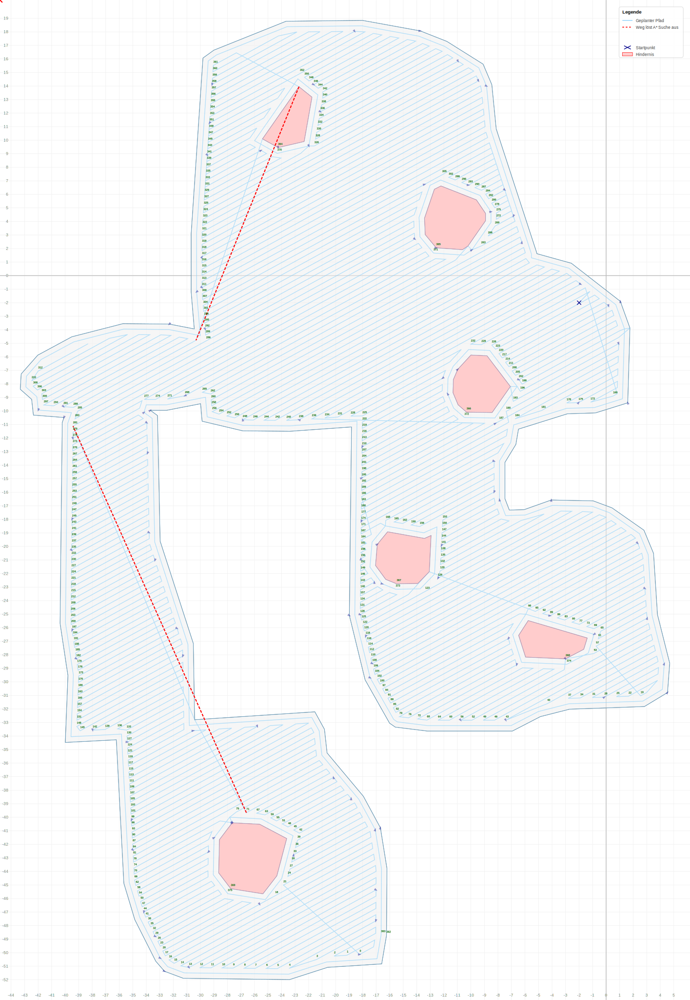

# CaSSAndRA Path Planner Core

---

## 🇬🇧 English

## Overview


This project provides a high-performance path planning engine written in C++, specifically designed for autonomous robotic lawnmowers (inspired by the CaSSAndRA project).

It solves the **Complete Coverage Path Planning (CCPP)** problem, allowing a robot to efficiently cover a defined area while avoiding obstacles (exclusions).

### Key Features

- **Multiple Patterns**  
  Supports:
  - "Lines" (parallel zig-zag mowing)
  - "Rings" (concentric mowing)
  - "Squares"

- **Clipper2 Integration**  
  Uses the state-of-the-art Clipper2 library for robust polygon offsetting and clipping.

- **Python Binding**  
  Seamless integration into Python environments via pybind11.

- **GeoJSON Support**  
  Easily load map data from standard GeoJSON formats. An example file is located in the root directory.

---

## Usage

### Build & Development (Makefile)
The project includes a Makefile (tested on macOS) to simplify the build process for different targets.

Available Commands

- **make: Compiles the standard standalone version.**

- **make test: Compiles and immediately runs the standalone debug test.**

- **make python_module: Compiles the C++ core as a Python-importable .so module using pybind11.**

### Build & Development (CMake)
The projet also includes CMake to build the project across different platforms (macOS, Linux/Raspberry Pi).

1. build using your global python interpreter

```bash
mkdir build
cd build
cmake ..
make
```
2. build using your virtual environment (venv)
```bash
cmake -B build -DPython_EXECUTABLE=$(pwd)/.venv/bin/python3
cd build
make
```

### Standalone (C++)

To test the planner without Python, use the provided `main.cpp` debug script.  
It reads a `example_map.json` and calculates the path directly.

> **Note:**  
> When running in standalone mode, the planner automatically generates an SVG file named `test_map.svg` in the root directory for visual verification of the calculated path and geometry.

#### Compilation Example

```bash
clang++ -std=c++20 -O3 -Iinclude -I/opt/homebrew/include src/*.cpp -o planner_test
./planner_test
```

---

### Python Integration

The core is designed to be compiled as a Python module (`planner_module`).

```python
import planner_module as pm

# Setup environment
peri = pm.Polygon([(0,0), (10,0), (10,10), (0,10)])
env = pm.Environment(peri)

# Configure settings
settings = pm.PathSettings()
settings.pattern = "lines"
settings.offset = 0.18

# Compute path
service = pm.PathService()
result = service.computeFullTask(env, settings, pm.Point(5, 5))
```

---

## 🇩🇪 Deutsch

## Überblick

Dieses Projekt bietet eine Hochleistungs-Pfadplanungs-Engine in C++, die speziell für autonome Rasenmäher-Roboter entwickelt wurde.

Es löst das Problem der vollständigen Flächenabdeckung  
(**Complete Coverage Path Planning – CCPP**) und ermöglicht es einem Roboter, definierte Flächen effizient zu mähen, während Hindernisse (Exclusions) umfahren werden.

### Hauptmerkmale

- **Mäh-Muster**
  - "Lines" (parallele Bahnen)
  - "Rings" (konzentrische Ringe)
  - "Squares"

- **Clipper2 Integration**  
  Nutzt die Clipper2-Bibliothek für robustes Polygon-Offsetting.

- **Python-Anbindung**  
  Nahtlose Integration in Python-Anwendungen mittels pybind11.

- **GeoJSON Support**  
  Lädt Kartendaten direkt aus dem standardisierten GeoJSON-Format. Eine Beispiel Datei ist im Root-Verzeichnis vorhanden.

---

## Benutzung

### Build & Entwicklung (Makefile)
Das Projekt enthält ein Makefile (getestet unter macOS), um die verschiedenen Build-Ziele einfach zu verwalten.

Verfügbare Befehle

- **make: Kompiliert die standardmäßige Stand-alone-Version.**

- **make test: Kompiliert und startet sofort den Stand-alone-Debug-Test.**

- **make python_module: Kompiliert den C++ Kern als Python-Modul (.so) mittels pybind11.**

### Build & Entwicklung (CMake)
Das Projekt enthält auch CMake um das Projekt auf unterschiedlichen Platformen bauen zu können(macOS, Linux/Raspberry Pi).

1. bauen mit globalen python Interpreter
```bash
mkdir build
cd build
cmake ..
make
```
2. bauen mit virtualer Umgebung (venv)
```bash
cmake -B build -DPython_EXECUTABLE=$(pwd)/.venv/bin/python3
cd build
make
```

### Eigenständig (C++)

Um den Planner ohne Python zu testen, kann das `main.cpp` Debug-Script genutzt werden.  
Es liest eine `example_map.json` ein und berechnet den Pfad direkt.

> **Hinweis:**  
> Im Stand-alone-Modus erzeugt der Planner automatisch eine SVG-Datei namens `test_map.svg` im Stammverzeichnis zur visuellen Kontrolle des berechneten Pfads.

#### Beispiel-Kompilierung

```bash
clang++ -std=c++20 -O3 -Iinclude -I/opt/homebrew/include src/*.cpp -o planner_test
./planner_test
```

---

### Python-Anbindung

Der Kern wird als Python-Modul (`planner_module`) kompiliert und eingebunden.

```python
import math
import planner_module as pm

# Umgebung erstellen
perimeter = pm.Polygon([(0,0), (20,0), (20,20), (0,20)])
env = pm.Environment(perimeter)

# Einstellungen festlegen
settings = pm.PathSettings()
settings.angle = math.radians(45)  # Rotation unterstützen
settings.offset = 0.18             # Messerbreite

# Pfad berechnen
service = pm.PathService()
start_pos = pm.Point(1, 1)
result = service.computeFullTask(env, settings, start_pos)
```

---

## Technical Requirements / Anforderungen

- C++20 Compiler (Clang, GCC)
- nlohmann-json (for GeoJSON support)
- pybind11 (for Python bindings)
- Clipper2 Library


## Donation

If you enjoyed the project — or just feeling generous, consider buying me a beer. Cheers!

[](https://www.paypal.com/donate/?hosted_button_id=DTLYLLR45ZMPW)

## Authors

- [@EinEinfach](https://www.github.com/EinEinfach)