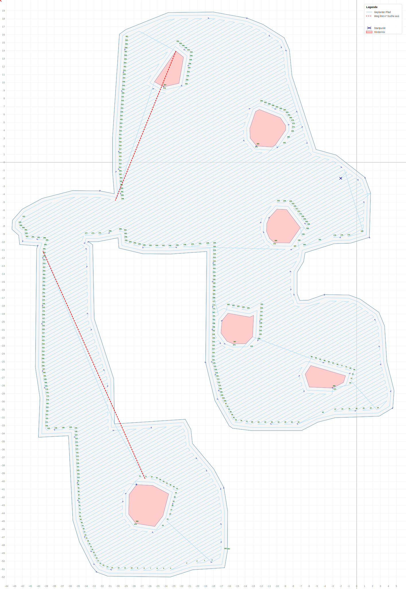

# CaSSAndRA Path Planner Core

---

## 🇬🇧 English

## Overview

In the world of autonomous mowing, the shortest path is rarely the best one. Unlike a vacuum robot that simply needs to get from A to B, a robotic mower is an artist: ***the path itself is the goal***. A perfectly mowed lawn is defined by the elegance of its lines and the consistency of its pattern.

While many path planners available online focus on classic "Point A to Point B" navigation or simple obstacle avoidance, the ***CaSSAndRA Path Planner Core*** is built for a different purpose. It addresses the ***Complete Coverage Path Planning (CCPP)*** problem with a focus on visual results and geometric precision. It ensures that every blade of grass is reached while maintaining a structured, professional look—whether in classic parallel lines, concentric rings, or sophisticated squares.




This project provides a high-performance path planning engine written in C++, specifically designed for autonomous robotic lawnmowers (inspired by the CaSSAndRA project).

### Key Features

- **Multiple Patterns: Lines (zig-zag), Rings (concentric), and Squares.**  

- **High Performance: Core engine written in C++20**  

- **Clipper2 Integration: Robust polygon offsetting and clipping**  

- **Python Binding: Seamless integration via pybind11**  

- **Cross-Platform: Supports Windows, macOS, and Linux (including Raspberry Pi 32-bit & 64-bit).**  


### Installation

The easiest way to use the planner in Python is via pip:

```bash
pip install coverage-path-planner
```
> **Note:**  
> This will install pre-compiled binaries for your architecture. No C++ compiler is required on the target system.

### Python usage example

```python
import coverage_path_planner as cpp

# Setup environment
# Create perimeter polygon and create environment 
peri = cpp.Polygon([cpp.Point(0,0), cpp.Point(10,0), cpp.Point(10,10), cpp.Point(0,10)])
env = cpp.Environment(peri)

# Add obstacles to environment (optional)
obs = cpp.Polygon([cpp.Point(3, 3), cpp.Point(3, 4), cpp.Point(4, 4)])
env.addObstacle(obs)

# Set virtual wire (optional): valid points for A* calculation. If no virtual wire added A* uses obstacle an perimeter points for search
search_wire = cpp.LineString()
search_wire.addPoint(cpp.Point(1, 1))
search_wire.addPoint(cpp.Point(9, 1))
env.setVirtualWire(search_wire) 

# Add working areas (optional). If no working areas added whole perimeter will be covered
work_area = cpp.Polygon([cpp.Point(2, 2), cpp.Point(2, 6), cpp.Point(8, 6), cpp.Point(8, 2)])
env.addMowArea(work_area)

# Configure settings
settings = cpp.PathSettings()
settings.pattern = "lines"  # possible patterns: lines, squares, rings
settings.offset = 0.18      # distance between coverage lines
settings.angle = 0.5        # coverage angle (RAD)
settings.distanceToBorder = 0.4   # distance to border
settings.mowArea = True       # cover area
settings.mowBorder = True     # calculate border laps (borderLaps must be > 0)
settings.mowBorderCcw = True  # border laps counter clockwise?
settings.borderLaps = 2       # how many border laps (every new lap gets offset of settings.offset)
settings.mowExclusionsBoder = True  # calculate exclusions laps (exclusionsBorderLaps must be > 0)
settings.mowExclusionsBorderCcw = True  # exclusions laps counter clockwise?
settings.exclusionsBorderLaps = 2       # how many exclusions laps (every new lap gets offset of settings.offset)

# Compute path
service = cpp.PathService()
result = service.computeFullTask(env, settings, cpp.Point(5, 5))
print(result.path.getPoints())
```

## Developement & Advanced Build

### Build & Development (Makefile)
The project includes a Makefile (tested on macOS) to simplify the build process for different targets.

Available Commands

- **make: Compiles the standard standalone version.**

- **make test: Compiles and immediately runs the standalone debug test.**

- **make python_module: Compiles the C++ core as a Python-importable .so module using pybind11.**

### Build & Development (CMake)
The projet also includes CMake to build the project across different platforms (macOS, Linux/Raspberry Pi).

1. build using your global python interpreter

```bash
mkdir build
cd build
cmake ..
make
```
2. build using your virtual environment (venv)
```bash
cmake -B build -DPython_EXECUTABLE=$(pwd)/.venv/bin/python3
cd build
make
```

### Standalone (C++)

To test the planner without Python, use the provided `main.cpp` debug script.  
It reads a `example_map.json` and calculates the path directly.

- **GeoJSON Support**  
  Easily load map data from standard GeoJSON formats. An example file is located in the root directory.

> **Note:**  
> When running in standalone mode, the planner automatically generates an SVG file named `test_map.svg` in the root directory for visual verification of the calculated path and geometry.

#### Compilation Example

```bash
clang++ -std=c++20 -O3 -Iinclude -I/opt/homebrew/include src/*.cpp -o planner_test
./planner_test
```


---

## 🇩🇪 Deutsch

## Überblick

In der Welt des autonomen Mähens ist der kürzeste Weg selten das Ziel. Anders als bei einem Staubsaugerroboter, der lediglich effizient von A nach B kommen muss, ist ein Mähroboter ein Künstler: ***Der Weg ist das Ziel.*** Ein perfekt gepflegter Rasen definiert sich über die Eleganz seiner Bahnen und die Gleichmäßigkeit seines Musters.

Viele Planungs-Algorithmen im Internet konzentrieren sich primär auf die klassische Navigation von "Punkt A zu Punkt B" oder einfache Hindernisumfahrung. Der ***CaSSAndRA Path Planner Core*** wurde für einen anderen Zweck erschaffen. Er löst das Problem der vollständigen Flächenabdeckung (***Complete Coverage Path Planning – CCPP***) mit einem klaren Fokus auf visuelle Ergebnisse und geometrische Präzision. Er stellt sicher, dass jeder Grashalm erreicht wird, während ein strukturiertes, professionelles Schnittbild erhalten bleibt – egal ob in klassischen parallelen Bahnen, konzentrischen Ringen oder präzisen Quadraten.

Dieses Projekt bietet eine Hochleistungs-Pfadplanungs-Engine in C++, die speziell für autonome Rasenmäher-Roboter entwickelt wurde.

### Hauptmerkmale

- **Unterschiedliche Muster: linesLines (zig-zag), Rings (concentric), and Squares**

- **Sehr schnell: Core engine geschrieben in C++20**  

- **Nutzt clipper2 Bibliothek für robuste Polygonberechnungen**  
  
- **Nahtlose Integration in Python-Anwendungen mittels pybind11.** 

- **Unterschiedliche Platformen: Unterstützt Windows, macOS und Linux (inkl. Raspberry PI 32-bit & 64-bit)** 


### Installation

Der einfachste Weg den Planner zu nutzen ist die Installation über pip:

```bash
pip install coverage-path-planner
```
> **Hinweis:**  
> Es wird eine vorkompilierte version des Planners installiert. Kein C++ Compiler auf dem Zielsystem notwendig. 

### Python Bespiel

```python
import coverage_path_planner as cpp

# Umgebung erstellen
peri = cpp.Polygon([cpp.Point(0,0), cpp.Point(10,0), cpp.Point(10,10), cpp.Point(0,10)])
env = cpp.Environment(peri)

# Füge Hindernisse hinzu (optional)
obs = cpp.Polygon([cpp.Point(3, 3), cpp.Point(3, 4), cpp.Point(4, 4)])
env.addObstacle(obs)

# Setze virtuellen Draht (optional). Wird für A* Suche verwendet, wenn kein virtueller Draht vorhanden ist, dass verwedet A* Perimeter- und Hindernis-Punkte für Wegsuche
search_wire = cpp.LineString()
search_wire.addPoint(cpp.Point(1, 1))
search_wire.addPoint(cpp.Point(9, 1))
env.setVirtualWire(search_wire) 

# Füge Arbeitsbereiche hinzu (optional). Wenn keine Arbeitsbereiche festgelegt sind, wird komplette Fläche bearbeitet
work_area = cpp.Polygon([cpp.Point(2, 2), cpp.Point(2, 6), cpp.Point(8, 6), cpp.Point(8, 2)])
env.addMowArea(work_area)

# Definiere Arbeitseinstellungen
settings = cpp.PathSettings()
settings.pattern = "lines"  # welche Muster ist gewünscht: lines, squares, rings
settings.offset = 0.18      # Abstand zwischen den Linien
settings.angle = 0.5        # Im welchen Winkel sollen die Linien verlaufen (RAD)
settings.distanceToBorder = 0.4   # Abstand zu Perimetergrenze
settings.mowArea = True       # Soll Fläche abgearbeitet werden
settings.mowBorder = True     # Soll die Perimeterkante abgefahren werden (borderLaps muss > 0 sein)
settings.mowBorderCcw = True  # Soll gegen Uhrzeigersinn abgefahren werden? 
settings.borderLaps = 2       # Wie viele Runde für Perimetergrenze (jede neue Runde wird um den settings.offset versetzt abgefahren)
settings.mowExclusionsBoder = True  # Sollen die Hindernissgrenzen abgefahren werden (exclusionsBorderLaps muss > 0 sein)
settings.mowExclusionsBorderCcw = True  #Soll gegen Uhrzeigersinn abgefahren werden?
settings.exclusionsBorderLaps = 2       # Wie viele Runden für Hindernissgrenzen (jede neue Runde wird um den settings.offset versetzt abgefahren)

# Compute path
service = cpp.PathService()
result = service.computeFullTask(env, settings, cpp.Point(5, 5))
print(result.path.getPoints())
```

### Entwicklung & fortgeschrittene Build

### Build & Entwicklung (Makefile)
Das Projekt enthält ein Makefile (getestet unter macOS), um die verschiedenen Build-Ziele einfach zu verwalten.

Verfügbare Befehle

- **make: Kompiliert die standardmäßige Stand-alone-Version.**

- **make test: Kompiliert und startet sofort den Stand-alone-Debug-Test.**

- **make python_module: Kompiliert den C++ Kern als Python-Modul (.so) mittels pybind11.**

### Build & Entwicklung (CMake)
Das Projekt enthält auch CMake um das Projekt auf unterschiedlichen Platformen bauen zu können(macOS, Linux/Raspberry Pi).

1. bauen mit globalen python Interpreter
```bash
mkdir build
cd build
cmake ..
make
```
2. bauen mit virtualer Umgebung (venv)
```bash
cmake -B build -DPython_EXECUTABLE=$(pwd)/.venv/bin/python3
cd build
make
```

### Eigenständig (C++)

Um den Planner ohne Python zu testen, kann das `main.cpp` Debug-Script genutzt werden.  
Es liest eine `example_map.json` ein und berechnet den Pfad direkt.

- **GeoJSON Support**  
  Lädt Kartendaten direkt aus dem standardisierten GeoJSON-Format. Eine Beispiel Datei ist im Root-Verzeichnis vorhanden.

> **Hinweis:**  
> Im Stand-alone-Modus erzeugt der Planner automatisch eine SVG-Datei namens `test_map.svg` im Stammverzeichnis zur visuellen Kontrolle des berechneten Pfads.

#### Beispiel-Kompilierung

```bash
clang++ -std=c++20 -O3 -Iinclude -I/opt/homebrew/include src/*.cpp -o planner_test
./planner_test
```

---

### Python-Anbindung

Der Kern wird als Python-Modul (`coverage_path_planner`) kompiliert und eingebunden.


---

## Technical Requirements (only for develpment) / Anforderungen (nur für Entwicklung)

- C++20 Compiler (Clang, GCC)
- nlohmann-json (for GeoJSON support)
- pybind11 (for Python bindings)
- Clipper2 Library


## Donation

If you enjoyed the project — or just feeling generous, consider buying me a beer. Cheers!

[](https://www.paypal.com/donate/?hosted_button_id=DTLYLLR45ZMPW)

## Authors

- [@EinEinfach](https://www.github.com/EinEinfach)